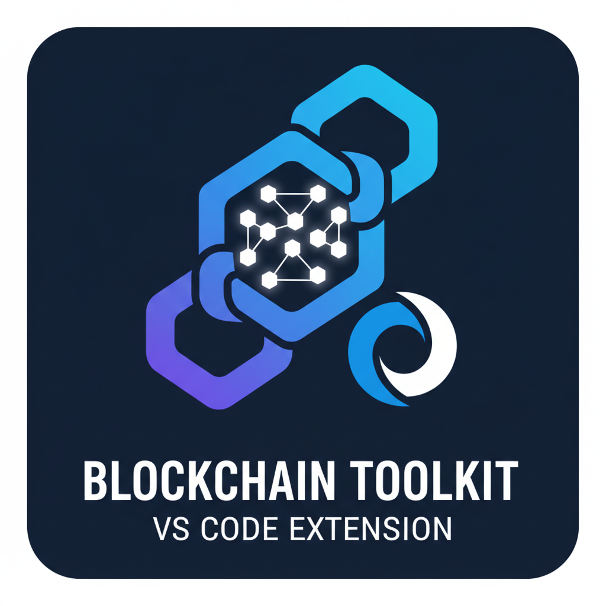

# Blockchain Toolkit

[](https://marketplace.visualstudio.com/items?itemName=blockchain-toolkit.blockchain-toolkit)
[](https://marketplace.visualstudio.com/items?itemName=blockchain-toolkit.blockchain-toolkit)
[](https://marketplace.visualstudio.com/items?itemName=blockchain-toolkit.blockchain-toolkit)
[](LICENSE)

> **The Ultimate VS Code Extension for Blockchain Development**

A comprehensive VS Code extension that transforms your development environment into a powerful blockchain IDE. Supporting multiple frameworks including **Hardhat**, **Truffle**, **Foundry**, **Ethers.js**, **Web3.js**, **Hyperledger Fabric**, and **Solana**, this extension provides everything you need for smart contract development, testing, deployment, and debugging.



## ✨ Features at a Glance

🔨 **Multi-Framework Support** - Hardhat, Truffle, Foundry, Solana with auto-detection  
🐛 **Advanced EVM Debugging** - Step-through debugging with memory & stack inspection  
🌐 **Network Management** - Visual network switching and real-time status monitoring  
🔗 **Service Integration** - Infura, Alchemy, Etherscan with secure credential management  
🛡️ **Security Analysis** - Built-in vulnerability detection and security reporting  
📊 **Gas Tracking** - Real-time gas price monitoring and optimization suggestions  
🔧 **Contract Interaction** - Read, write, and monitor smart contracts directly  
📝 **Smart Templates** - ERC20, ERC721, DAO templates with one-click generation

## 🏗️ Supported Frameworks

### Primary Blockchain Frameworks
- **🔨 Hardhat**: Ethereum development environment with built-in testing and debugging
- **🍫 Truffle**: Classic smart contract development framework with migration system
- **⚡ Foundry**: Fast and portable Ethereum testing framework written in Rust
- **☀️ Solana/Anchor**: High-performance blockchain with Rust-based smart contracts

### Additional Framework Support
- **📚 Ethers.js**: Complete Ethereum library and wallet implementation
- **🕸️ Web3.js**: Collection of libraries for interacting with Ethereum
- **🔗 Hyperledger Fabric**: Enterprise-grade permissioned blockchain framework
- **🐍 Brownie**: Python-based development and testing framework for Ethereum

### Cross-Platform Features
- **🔄 Automatic Detection**: Intelligently detects and configures frameworks
- **🎯 Unified Commands**: Single interface for all framework operations
- **⚡ Hot Switching**: Seamlessly switch between frameworks in multi-framework projects
- **🔧 Custom Configurations**: Framework-specific settings and optimizations

## 🚀 Features Overview

### 📚 Documentation System
- **HTML Generation**: Automated documentation with customizable themes
- **Multi-Platform Deployment**: GitHub Pages, Netlify, Vercel, AWS S3
- **Coverage Reports**: Integrated test coverage visualization
- **API Documentation**: Automatic API reference generation
- **Live Preview**: Real-time documentation preview server
- **Custom Templates**: Configurable documentation templates

### ⚙️ CI/CD Integration
- **Multi-Platform Support**: GitHub Actions, GitLab CI, Jenkins, CircleCI, Azure DevOps
- **Automated Workflows**: Smart contract compilation, testing, and deployment pipelines
- **Environment Management**: Development, staging, and production environments
- **Security Scanning**: Automated vulnerability detection and reporting
- **Deployment Automation**: Multi-network deployment with approval gates
- **Artifact Management**: Build artifact storage and versioning

### 🔗 Contract Interaction
- **Real-Time Monitoring**: Live contract state monitoring and event watching
- **Proxy Management**: Transparent and UUPS proxy detection and management
- **Event Filtering**: Advanced event filtering and historical analysis
- **ABI Management**: Automatic ABI discovery and storage
- **Batch Operations**: Execute multiple contract calls efficiently
- **State Inspection**: Deep dive into contract storage and memory

### 🛠️ Development Tools
- **Multi-Network Faucets**: Automated testnet token requests
- **HD Wallet Generation**: Secure wallet creation with mnemonic phrases
- **Block Explorer Integration**: Seamless integration with popular block explorers
- **Transaction Monitoring**: Real-time transaction tracking and analysis
- **Portfolio Tracking**: Multi-wallet balance and asset monitoring
- **Account Management**: Secure account creation and management

### 🧪 Advanced Testing
- **Coverage Analysis**: Comprehensive test coverage reporting with HTML output
- **Gas Optimization**: Gas usage analysis and optimization suggestions
- **Fuzz Testing**: Property-based testing with customizable parameters
- **Integration Testing**: Multi-contract and cross-chain testing capabilities
- **Performance Analysis**: Benchmark testing and performance metrics
- **Security Testing**: Automated security vulnerability scanning

### 📝 Smart Contract Templates
- **ERC Standards**: Pre-built ERC20, ERC721, ERC1155 templates with extensions
- **DAO Governance**: Complete DAO templates with voting mechanisms
- **DeFi Protocols**: DEX, lending, staking, and yield farming templates
- **Gaming Contracts**: NFT gaming, marketplace, and reward system templates
- **Custom Features**: Pausable, upgradeable, and access control patterns

## 🛠️ Installation & Setup

### Requirements

**Essential Prerequisites:**
- **Node.js** (v16 or higher) - Required for Ethereum-based frameworks
- **npm/yarn/pnpm** - Package manager for dependencies
- **VS Code** (v1.74.0 or higher) - Latest VS Code version recommended

**Framework-Specific Requirements:**
- **Rust & Cargo** - For Solana/Anchor and Foundry development
- **Python 3.8+** - For Brownie framework support
- **Docker** (Optional) - For containerized blockchain nodes
- **Git** - For version control and repository operations

### Installation Methods

#### Method 1: VS Code Marketplace (Recommended)
```bash
# Search "Blockchain Toolkit" in VS Code Extensions
# Or install via command line:
code --install-extension blockchain-toolkit
```

#### Method 2: Manual Installation from VSIX
```bash
# Download the latest VSIX from releases
code --install-extension blockchain-toolkit-0.1.0.vsix
```

#### Method 3: Development Installation
```bash
# Clone and build from source
git clone https://github.com/your-org/blockchain-toolkit.git
cd blockchain-toolkit
npm install
npm run compile
code .
# Press F5 to launch Extension Development Host
```

### Post-Installation Setup

1. **Framework Detection**: Open a blockchain project - the extension auto-detects frameworks
2. **Network Configuration**: Configure networks in framework config files
3. **Service Integration**: Set up API keys for Infura, Alchemy, etc.
4. **Extension Settings**: Customize extension behavior in VS Code settings

## 🚀 Quick Start Guide

### For Existing Projects

#### Hardhat Projects
1. Open your Hardhat project in VS Code
2. Extension automatically detects `hardhat.config.js/ts`
3. Use **Blockchain Explorer** in sidebar for project navigation
4. Access commands via Command Palette (`Ctrl+Shift+P`)

#### Truffle Projects
1. Open folder containing `truffle-config.js`
2. Extension detects Truffle configuration
3. Use unified commands for compilation and deployment

#### Foundry Projects
1. Open folder with `foundry.toml`
2. Extension configures Forge and Cast tools
3. Access Rust-based testing and deployment features

### Creating New Projects

#### New Hardhat Project
```bash
# Command Palette: "Blockchain: Create New Hardhat Project"
# Or use the terminal:
mkdir my-blockchain-project
cd my-blockchain-project
npx hardhat init
```

#### New Foundry Project
```bash
# Command Palette: "Blockchain: Create New Foundry Project"
# Or use the terminal:
forge init my-foundry-project
cd my-foundry-project
```

#### New Multi-Framework Project
```bash
# Command Palette: "Blockchain: Create Multi-Framework Project"
# Creates a project supporting multiple frameworks
```

### First Steps After Project Creation

1. **Install Dependencies**: `npm install` or framework-specific install
2. **Configure Networks**: Edit config files for your target networks
3. **Write Contracts**: Create Solidity contracts in the `contracts/` folder
4. **Compile**: Use `Blockchain: Compile Contracts` command
5. **Test**: Write and run tests using `Blockchain: Run Tests`
6. **Deploy**: Deploy to networks using `Blockchain: Deploy Contracts`

## 📋 Available Commands

Access all commands via Command Palette (`Ctrl+Shift+P` / `Cmd+Shift+P`):

### 🔨 Core Development Commands
- `Blockchain: Compile Contracts` - Compile all smart contracts
- `Blockchain: Run Tests` - Execute the complete test suite
- `Blockchain: Deploy Contracts` - Deploy contracts to selected network
- `Blockchain: Clean Artifacts` - Clean compilation artifacts
- `Blockchain: Initialize Project` - Set up new blockchain project
- `Blockchain: Install Dependencies` - Install framework dependencies

### 🐛 Debugging Commands
- `Blockchain: Debug Contract` - Start debugging session for current contract
- `Blockchain: Debug Test` - Debug selected test file
- `Blockchain: Debug Transaction` - Debug specific transaction hash
- `Blockchain: EVM Debug: Start` - Start EVM state debugging
- `Blockchain: EVM Debug: Step Forward` - Step forward in EVM execution
- `Blockchain: EVM Debug: Step Backward` - Step backward in EVM execution
- `Blockchain: EVM Debug: Show Memory` - Display EVM memory dump
- `Blockchain: EVM Debug: Show Stack` - Display EVM stack trace
- `Blockchain: EVM Debug: Show Storage` - Display contract storage state

### 🌐 Network Management Commands
- `Blockchain: Select Network` - Switch between configured networks
- `Blockchain: Add Network` - Add new custom network
- `Blockchain: Edit Network` - Modify network configuration
- `Blockchain: Remove Network` - Delete network configuration
- `Blockchain: Check Network Status` - Verify network connectivity
- `Blockchain: Start Local Node` - Start local blockchain node
- `Blockchain: Stop Local Node` - Stop local blockchain node

### 📚 Documentation Commands
- `Blockchain: Generate Documentation` - Generate HTML documentation
- `Blockchain: Deploy Documentation` - Deploy docs to platforms
- `Blockchain: Preview Documentation` - Live preview documentation
- `Blockchain: Generate Coverage Report` - Create test coverage documentation
- `Blockchain: Export API Documentation` - Export API reference

### ⚙️ CI/CD Commands
- `Blockchain: Setup GitHub Actions` - Configure GitHub Actions workflow
- `Blockchain: Setup GitLab CI` - Configure GitLab CI pipeline
- `Blockchain: Setup Jenkins` - Configure Jenkins pipeline
- `Blockchain: Deploy to Staging` - Deploy to staging environment
- `Blockchain: Deploy to Production` - Deploy to production environment
- `Blockchain: Run Security Scan` - Execute security vulnerability scan

### 🔗 Contract Interaction Commands
- `Blockchain: Monitor Contract` - Start real-time contract monitoring
- `Blockchain: Watch Events` - Monitor contract events
- `Blockchain: Call Contract Function` - Execute contract function
- `Blockchain: Send Transaction` - Send transaction to contract
- `Blockchain: Inspect Contract State` - View contract storage
- `Blockchain: Manage Proxy` - Manage proxy contracts

### 🛠️ Development Tools Commands
- `Blockchain: Request Testnet Tokens` - Get tokens from faucets
- `Blockchain: Generate Wallet` - Create new HD wallet
- `Blockchain: Import Wallet` - Import existing wallet
- `Blockchain: Check Balances` - View wallet balances
- `Blockchain: Open Block Explorer` - Open transaction in explorer
- `Blockchain: Track Portfolio` - Monitor portfolio performance

### 🧪 Testing Commands
- `Blockchain: Run Coverage Analysis` - Generate test coverage report
- `Blockchain: Optimize Gas Usage` - Analyze and optimize gas
- `Blockchain: Run Fuzz Tests` - Execute property-based testing
- `Blockchain: Run Integration Tests` - Execute integration test suite
- `Blockchain: Benchmark Performance` - Run performance benchmarks
- `Blockchain: Security Analysis` - Run security analysis tools

### 📝 Template Commands
- `Blockchain: Create ERC20 Token` - Generate ERC20 contract template
- `Blockchain: Create ERC721 NFT` - Generate ERC721 contract template
- `Blockchain: Create ERC1155 Token` - Generate ERC1155 contract template
- `Blockchain: Create DAO Contract` - Generate DAO governance template
- `Blockchain: Create DeFi Protocol` - Generate DeFi contract templates
- `Blockchain: Create Gaming Contract` - Generate gaming contract templates

### 🔧 Service Integration Commands
- `Blockchain: Configure Infura` - Set up Infura integration
- `Blockchain: Configure Alchemy` - Set up Alchemy integration
- `Blockchain: Configure Etherscan` - Set up Etherscan integration
- `Blockchain: Verify Contract` - Verify contract on block explorer
- `Blockchain: Manage API Keys` - Secure API key management

## ⚙️ Configuration

### Extension Settings

Configure the extension in VS Code settings (`Ctrl+,` / `Cmd+,`):

```json
{
  // Core Settings
  "blockchain.autoDetectFrameworks": true,
  "blockchain.defaultFramework": "hardhat",
  "blockchain.autoCompile": false,
  "blockchain.enableDebugMode": false,

  // Network Settings
  "blockchain.defaultNetwork": "localhost",
  "blockchain.networkTimeout": 30000,
  "blockchain.enableNetworkMonitoring": true,

  // Compiler Settings
  "blockchain.solidity.version": "0.8.19",
  "blockchain.solidity.optimizer": true,
  "blockchain.solidity.optimizerRuns": 200,

  // Testing Settings
  "blockchain.enableGasReporting": true,
  "blockchain.enableCoverage": true,
  "blockchain.testTimeout": 60000,

  // Documentation Settings
  "blockchain.docs.theme": "default",
  "blockchain.docs.autoGenerate": false,
  "blockchain.docs.includeCoverage": true,

  // CI/CD Settings
  "blockchain.cicd.autoSetup": false,
  "blockchain.cicd.platform": "github",
  "blockchain.cicd.enableSecurity": true,

  // Service Integration
  "blockchain.infura.enabled": false,
  "blockchain.alchemy.enabled": false,
  "blockchain.etherscan.enabled": true,

  // Security Settings
  "blockchain.security.enableAnalysis": true,
  "blockchain.security.autoScan": false,
  "blockchain.security.level": "medium"
}
```

### Framework-Specific Configuration

#### Hardhat Configuration
```javascript
// hardhat.config.js
require("@nomicfoundation/hardhat-toolbox");
require("@nomiclabs/hardhat-etherscan");

module.exports = {
  solidity: {
    version: "0.8.19",
    settings: {
      optimizer: {
        enabled: true,
        runs: 200
      }
    }
  },
  networks: {
    localhost: {
      url: "http://127.0.0.1:8545",
      chainId: 31337
    },
    goerli: {
      url: process.env.GOERLI_URL || "",
      accounts: process.env.PRIVATE_KEY ? [process.env.PRIVATE_KEY] : []
    },
    mainnet: {
      url: process.env.MAINNET_URL || "",
      accounts: process.env.PRIVATE_KEY ? [process.env.PRIVATE_KEY] : []
    }
  },
  etherscan: {
    apiKey: process.env.ETHERSCAN_API_KEY
  },
  gasReporter: {
    enabled: true,
    currency: 'USD',
    gasPrice: 20
  }
};
```

#### Foundry Configuration
```toml
# foundry.toml
[profile.default]
src = "src"
out = "out"
libs = ["lib"]
solc_version = "0.8.19"
optimizer = true
optimizer_runs = 200
via_ir = false

[profile.ci]
fuzz = { runs = 10_000 }
invariant = { runs = 1_000 }

[rpc_endpoints]
localhost = "http://localhost:8545"
goerli = "${GOERLI_RPC_URL}"
mainnet = "${MAINNET_RPC_URL}"

[etherscan]
goerli = { key = "${ETHERSCAN_API_KEY}" }
mainnet = { key = "${ETHERSCAN_API_KEY}" }
```

#### Truffle Configuration
```javascript
// truffle-config.js
module.exports = {
  networks: {
    development: {
      host: "127.0.0.1",
      port: 8545,
      network_id: "*"
    },
    goerli: {
      provider: () => new HDWalletProvider(
        process.env.MNEMONIC,
        `https://goerli.infura.io/v3/${process.env.INFURA_KEY}`
      ),
      network_id: 5,
      gas: 5500000,
      confirmations: 2,
      timeoutBlocks: 200,
      skipDryRun: true
    }
  },
  compilers: {
    solc: {
      version: "0.8.19",
      settings: {
        optimizer: {
          enabled: true,
          runs: 200
        }
      }
    }
  },
  plugins: [
    'truffle-plugin-verify'
  ],
  api_keys: {
    etherscan: process.env.ETHERSCAN_API_KEY
  }
};
```

### Environment Variables

Create a `.env` file in your project root:

```bash
# Network RPC URLs
MAINNET_URL=https://mainnet.infura.io/v3/YOUR_INFURA_KEY
GOERLI_URL=https://goerli.infura.io/v3/YOUR_INFURA_KEY
SEPOLIA_URL=https://sepolia.infura.io/v3/YOUR_INFURA_KEY
POLYGON_URL=https://polygon-mainnet.infura.io/v3/YOUR_INFURA_KEY

# Private Keys (use with caution)
PRIVATE_KEY=your_private_key_here
MNEMONIC=your twelve word mnemonic phrase here

# API Keys
INFURA_KEY=your_infura_project_id
ALCHEMY_KEY=your_alchemy_api_key
ETHERSCAN_API_KEY=your_etherscan_api_key
POLYGONSCAN_API_KEY=your_polygonscan_api_key

# CI/CD Settings
GITHUB_TOKEN=your_github_token
DEPLOY_KEY=your_deployment_key
```

## 📁 Project Structure

The extension recognizes and supports multiple project structures:

### Hardhat Project Structure
```
my-hardhat-project/
├── contracts/              # Solidity smart contracts
│   ├── MyContract.sol
│   └── interfaces/
├── scripts/                # Deployment and utility scripts
│   ├── deploy.js
│   └── upgrade.js
├── test/                   # Test files (JavaScript/TypeScript)
│   ├── MyContract.test.js
│   └── integration/
├── artifacts/              # Compiled contract artifacts (auto-generated)
├── cache/                  # Hardhat cache (auto-generated)
├── typechain-types/        # TypeScript type definitions (auto-generated)
├── hardhat.config.js       # Hardhat configuration
├── package.json           # Node.js dependencies
├── .env                   # Environment variables
└── README.md              # Project documentation
```

### Foundry Project Structure
```
my-foundry-project/
├── src/                    # Solidity contracts
│   ├── MyContract.sol
│   └── interfaces/
├── test/                   # Solidity test files
│   ├── MyContract.t.sol
│   └── utils/
├── script/                 # Deployment scripts
│   └── Deploy.s.sol
├── out/                    # Compiled artifacts (auto-generated)
├── cache/                  # Forge cache (auto-generated)
├── lib/                    # Dependencies (git submodules)
├── foundry.toml           # Foundry configuration
├── .env                   # Environment variables
└── README.md              # Project documentation
```

### Truffle Project Structure
```
my-truffle-project/
├── contracts/              # Solidity contracts
│   ├── MyContract.sol
│   └── Migrations.sol
├── migrations/             # Deployment migrations
│   ├── 1_initial_migration.js
│   └── 2_deploy_contracts.js
├── test/                   # Test files
│   ├── mycontract.js
│   └── TestMyContract.sol
├── build/                  # Compiled contracts (auto-generated)
├── truffle-config.js      # Truffle configuration
├── package.json           # Node.js dependencies
└── README.md              # Project documentation
```


## 🐛 Advanced Debugging

The extension provides comprehensive native debugging support for Solidity contracts and blockchain transactions using VS Code's Debug Adapter Protocol.

### EVM State Debugging Features

#### 🎯 Step-Through Debugging
- **Breakpoint Support**: Set breakpoints in Solidity contracts and test files
- **Execution Control**: Step over, step into, step out, continue execution
- **Frame Navigation**: Navigate through call stack and execution frames
- **State Inspection**: Real-time inspection of contract state and variables

#### 🔍 EVM State Analysis
- **Stack Inspection**: View and analyze EVM stack contents with type detection
- **Memory Analysis**: Inspect EVM memory with chunk visualization and search
- **Storage Inspection**: Deep dive into contract storage slots and mappings
- **Call Data Analysis**: Decode and analyze transaction call data and parameters

#### 📊 Advanced Debug Features
- **Gas Analysis**: Track gas usage throughout execution
- **Event Monitoring**: Monitor and filter emitted events during execution
- **Proxy Detection**: Automatic detection and debugging of proxy contracts
- **Multi-Network Support**: Debug on any EVM-compatible network

### Getting Started with Debugging

#### Setting Up Debug Configuration

Create `.vscode/launch.json` for custom debug configurations:

```json
{
    "version": "0.2.0",
    "configurations": [
        {
            "name": "Debug Solidity Contract",
            "request": "launch",
            "type": "blockchain",
            "program": "${workspaceFolder}/contracts/MyContract.sol",
            "network": "hardhat",
            "rpcUrl": "http://localhost:8545",
            "console": "integratedTerminal"
        },
        {
            "name": "Debug Test File",
            "request": "launch",
            "type": "blockchain",
            "program": "${workspaceFolder}/test/MyContract.test.js",
            "network": "localhost",
            "framework": "hardhat"
        },
        {
            "name": "Debug Transaction",
            "request": "launch",
            "type": "blockchain-transaction",
            "transactionHash": "0x...",
            "network": "goerli",
            "rpcUrl": "https://goerli.infura.io/v3/YOUR_KEY"
        }
    ]
}
```

#### Quick Debug Commands

1. **Contract Debugging**: Place cursor in contract → `F5` or `Blockchain: Debug Contract`
2. **Test Debugging**: Open test file → `Blockchain: Debug Test`
3. **Transaction Debugging**: `Blockchain: Debug Transaction` → Enter TX hash
4. **EVM State Debugging**: `Blockchain: EVM Debug: Start`

### Debug Interface Components

#### 🎛️ Debug Controls
- **Variables Panel**: Inspect local variables, contract state, and global variables
- **Call Stack Panel**: Navigate through function calls and contract interactions
- **Breakpoints Panel**: Manage and toggle breakpoints
- **Watch Panel**: Monitor specific expressions and variables
- **Debug Console**: Execute commands and evaluate expressions

#### 📱 EVM Debug Tree View
- **Execution Control**: Current frame, operation, program counter, gas remaining
- **EVM Stack**: Stack items with type detection and value formatting
- **Memory Dump**: Memory chunks with offset addresses and type analysis
- **Storage State**: Contract storage slots with variable name resolution
- **Global Variables**: msg.sender, msg.value, block data, and transaction info
- **Call Data**: Function selector and decoded parameters
- **Emitted Events**: Real-time event monitoring with parameter decoding

### Debug Commands Reference

```typescript
// EVM Debug Commands
Blockchain: EVM Debug: Start              // Start EVM debugging session
Blockchain: EVM Debug: Step Forward       // Step to next instruction
Blockchain: EVM Debug: Step Backward      // Step to previous instruction
Blockchain: EVM Debug: Show Memory        // Display memory dump
Blockchain: EVM Debug: Show Stack         // Display stack trace
Blockchain: EVM Debug: Show Storage       // Display storage state
Blockchain: EVM Debug: Export State       // Export current EVM state
Blockchain: EVM Debug: Analyze Gas        // Analyze gas usage
Blockchain: EVM Debug: Find in Memory     // Search memory contents

// Transaction Debugging
Blockchain: Debug Transaction             // Debug specific transaction
Blockchain: Debug Contract                // Debug contract execution
Blockchain: Debug Test                    // Debug test execution
```

### Supported Debug Types

- **Contract Execution**: Debug smart contract function calls
- **Test Execution**: Debug JavaScript/TypeScript test files
- **Transaction Replay**: Debug historical transactions
- **Live Debugging**: Debug transactions in real-time
- **Multi-Contract**: Debug complex multi-contract interactions
- **Proxy Contracts**: Debug through proxy implementations

### Framework-Specific Debugging

#### Hardhat Debugging
- Integrated with Hardhat Network for local debugging
- Support for Hardhat's console.log debugging
- Automatic compilation and deployment for debugging

#### Foundry Debugging
- Integration with Anvil local node
- Support for Forge test debugging
- Rust-based debugging capabilities

#### Truffle Debugging
- Integration with Truffle Develop
- Support for Truffle Debugger commands
- Migration debugging support

For detailed debugging documentation, see the extension's built-in documentation.

## 🌐 Network Management

The extension provides comprehensive visual network management with real-time status monitoring and seamless configuration.

### Network Management Features

#### 📊 Visual Network Dashboard
- **Real-time Status Indicators**: Live connection status for all configured networks
- **Network Health Monitoring**: Automatic connectivity checks and performance metrics
- **Block Height Tracking**: Real-time block number updates
- **Gas Price Monitoring**: Current gas prices and recommendations
- **Chain Information**: Network ID, currency, explorer links

#### 🔄 Network Operations
- **One-Click Switching**: Seamlessly switch between networks
- **Bulk Operations**: Perform operations across multiple networks
- **Network Templates**: Pre-configured templates for popular networks
- **Custom Network Wizard**: Step-by-step custom network configuration
- **Network Import/Export**: Share network configurations

#### 📈 Monitoring & Analytics
- **Performance Metrics**: Latency, throughput, and reliability statistics
- **Historical Data**: Track network performance over time
- **Alert System**: Notifications for network issues and changes
- **Health Scores**: Automated network quality assessment

### Supported Network Types

#### 🏠 Local Development Networks
- **Hardhat Network**: Local development blockchain
- **Anvil (Foundry)**: Fast local Ethereum node
- **Ganache**: Personal blockchain for Ethereum development
- **Custom Local**: User-defined local networks

#### 🧪 Ethereum Testnets
- **Goerli**: Proof-of-Authority testnet
- **Sepolia**: Proof-of-Stake testnet
- **Holesky**: Ethereum 2.0 testnet
- **Rinkeby**: Legacy testnet (deprecated)

#### 🌍 Ethereum Mainnet
- **Ethereum Mainnet**: Primary Ethereum network
- **Custom RPC**: User-defined Ethereum-compatible networks

#### ⚡ Layer 2 Networks
- **Polygon**: Polygon PoS Chain
- **Arbitrum**: Arbitrum One and Nova
- **Optimism**: Optimistic Ethereum
- **Base**: Coinbase Layer 2
- **Avalanche**: Avalanche C-Chain
- **Fantom**: Fantom Opera
- **BSC**: Binance Smart Chain

#### 🔗 Cross-Chain Networks
- **Polkadot**: Polkadot relay chain
- **Cosmos**: Cosmos Hub
- **Solana**: Solana mainnet and devnet
- **Near**: Near Protocol networks

### Network Configuration Examples

#### Basic Network Configuration
```javascript
// hardhat.config.js
module.exports = {
  networks: {
    // Local development
    localhost: {
      url: "http://127.0.0.1:8545",
      chainId: 31337,
      accounts: "remote" // Use existing accounts
    },
    
    // Ethereum testnets
    goerli: {
      url: `https://goerli.infura.io/v3/${process.env.INFURA_KEY}`,
      accounts: [process.env.PRIVATE_KEY],
      chainId: 5,
      gasPrice: 20000000000, // 20 gwei
      gas: 6000000
    },
    
    // Ethereum mainnet
    mainnet: {
      url: `https://mainnet.infura.io/v3/${process.env.INFURA_KEY}`,
      accounts: [process.env.PRIVATE_KEY],
      chainId: 1,
      gasPrice: "auto",
      gas: "auto"
    },
    
    // Layer 2 networks
    polygon: {
      url: "https://polygon-rpc.com",
      accounts: [process.env.PRIVATE_KEY],
      chainId: 137,
      gasPrice: 30000000000 // 30 gwei
    },
    
    arbitrum: {
      url: "https://arb1.arbitrum.io/rpc",
      accounts: [process.env.PRIVATE_KEY],
      chainId: 42161
    }
  }
};
```

#### Advanced Network Configuration
```javascript
// Advanced network with custom configuration
networks: {
  customNetwork: {
    url: "https://custom-rpc.example.com",
    accounts: {
      mnemonic: process.env.MNEMONIC,
      path: "m/44'/60'/0'/0",
      initialIndex: 0,
      count: 10
    },
    chainId: 1337,
    gasPrice: 20000000000,
    gas: 8000000,
    gasMultiplier: 1.2,
    timeout: 60000,
    httpHeaders: {
      "Authorization": `Bearer ${process.env.API_TOKEN}`
    },
    blockConfirmations: 2,
    skipDryRun: false,
    timeoutBlocks: 200
  }
}
```

### Network Status Indicators

#### Status Icons
- 🟢 **Connected**: Network is reachable and responding normally
- 🟡 **Connecting**: Currently establishing connection
- 🟠 **Slow**: Network responding but with high latency
- 🔴 **Error**: Network connection failed or unreachable
- ⚪ **Disconnected**: No connection attempt made
- ⏸️ **Paused**: Network monitoring temporarily disabled

#### Information Display
- **Chain ID**: Network identifier
- **Block Height**: Current block number
- **Gas Price**: Current recommended gas price
- **Latency**: Network response time
- **Provider**: RPC provider information
- **Currency**: Native network currency

### Network Management Commands

```bash
# Network Selection and Switching
Blockchain: Select Network                # Choose active network
Blockchain: Switch to Mainnet            # Quick switch to Ethereum mainnet
Blockchain: Switch to Testnet            # Quick switch to testnet

# Network Configuration
Blockchain: Add Network                   # Add new custom network
Blockchain: Edit Network                  # Modify existing network
Blockchain: Remove Network                # Delete network configuration
Blockchain: Import Network Config         # Import network from file
Blockchain: Export Network Config         # Export network configuration

# Network Monitoring
Blockchain: Check Network Status          # Test network connectivity
Blockchain: Monitor All Networks          # Start monitoring all networks
Blockchain: Network Health Report         # Generate network health report
Blockchain: Reset Network Cache           # Clear network cache and reconnect

# Network Utilities
Blockchain: View Network Info             # Display detailed network information
Blockchain: Compare Networks              # Compare network performance
Blockchain: Network Diagnostics           # Run network diagnostic tests
```

### Network Management GUI

#### Networks Tree View
- **Organized Categories**: Networks grouped by type (Local, Testnets, Mainnets, L2)
- **Status Indicators**: Real-time visual status for each network
- **Context Menus**: Right-click for network-specific actions
- **Quick Actions**: Toolbar buttons for common operations
- **Search and Filter**: Find networks quickly

#### Network Configuration Wizard
- **Step-by-Step Setup**: Guided network configuration process
- **Validation**: Automatic validation of network settings
- **Templates**: Pre-built templates for popular networks
- **Import Options**: Import from various sources (MetaMask, etc.)
- **Testing**: Test connection before saving

For detailed network management documentation, see the extension's built-in documentation.

## 🚧 Development & Troubleshooting

### Extension Development

#### Setting Up Development Environment
```bash
# Clone the repository
git clone https://github.com/your-org/blockchain-toolkit.git
cd blockchain-toolkit

# Install dependencies
npm install

# Compile TypeScript
npm run compile

# Watch for changes during development
npm run watch

# Run tests
npm test

# Package extension
npm run package
```

#### Development Commands
```bash
# Start development
npm run dev                 # Start development mode
npm run watch              # Watch for file changes
npm run compile            # Compile TypeScript
npm run lint               # Run ESLint
npm run test               # Run test suite
npm run package            # Create VSIX package
```

#### Debug Extension in VS Code
1. Open the project in VS Code
2. Press `F5` to launch Extension Development Host
3. Test extension features in the new window
4. Use Debug Console for logging and debugging
5. Reload window with `Ctrl+R` / `Cmd+R` after changes

### Common Issues & Solutions

#### Extension Not Activating
**Symptoms**: Extension commands not available, no activation

**Solutions**:
- ✅ Ensure workspace contains supported framework files (`hardhat.config.js`, `foundry.toml`, etc.)
- ✅ Check VS Code Output panel (View → Output → Blockchain Toolkit) for errors
- ✅ Restart VS Code after installation
- ✅ Verify extension is enabled in Extensions panel

#### Commands Not Working
**Symptoms**: Commands fail or show errors

**Solutions**:
- ✅ Verify framework dependencies are installed (`npm list hardhat`, `forge --version`)
- ✅ Check terminal output for error messages
- ✅ Enable debug mode in extension settings
- ✅ Ensure proper network configuration

#### Compilation Errors
**Symptoms**: Contracts fail to compile

**Solutions**:
- ✅ Verify Solidity version compatibility
- ✅ Check import paths and dependencies
- ✅ Clear compilation cache: `Blockchain: Clean Artifacts`
- ✅ Update compiler version in configuration

#### Network Connection Issues
**Symptoms**: Network operations fail, timeouts

**Solutions**:
- ✅ Verify RPC URL accessibility
- ✅ Check API key validity (Infura, Alchemy)
- ✅ Increase network timeout in settings
- ✅ Test network connectivity manually

#### Debugging Issues
**Symptoms**: Breakpoints not hit, debug session fails

**Solutions**:
- ✅ Ensure local node is running
- ✅ Verify debug configuration in `launch.json`
- ✅ Check contract deployment status
- ✅ Use correct network for debugging

### Performance Optimization

#### Extension Performance
- **Lazy Loading**: Features loaded on demand to reduce startup time
- **Caching**: Network status and compilation results cached
- **Background Tasks**: Heavy operations run in background
- **Memory Management**: Proper cleanup of resources

#### Project Performance
- **Incremental Compilation**: Only compile changed contracts
- **Parallel Testing**: Run tests in parallel when possible
- **Gas Optimization**: Built-in gas analysis and optimization suggestions
- **Efficient Networking**: Connection pooling and request optimization

### Logging & Diagnostics

#### Enable Debug Logging
```json
{
  "blockchain.enableDebugMode": true,
  "blockchain.logLevel": "debug"
}
```

#### View Logs
1. Open VS Code Output panel (`View → Output`)
2. Select "Blockchain Toolkit" from dropdown
3. View real-time logs and error messages
4. Copy logs for issue reporting

#### Diagnostic Commands
```bash
Blockchain: Show Diagnostics          # Display system information
Blockchain: Export Logs               # Export logs to file
Blockchain: Reset Extension           # Reset extension state
Blockchain: Validate Configuration    # Check configuration validity
```

### Getting Help

#### Documentation Resources
- 📖 [Extension Documentation](https://me-saurabhkohli.github.io/blockchain-toolkit)
- 📋 [Quick Start Guide](https://me-saurabhkohli.github.io/blockchain-toolkit/docs.html)
- ⚙️ [Configuration Reference](https://me-saurabhkohli.github.io/blockchain-toolkit/docs.html)

#### Community Support
- 💬 [GitHub Discussions](https://github.com/me-saurabhkohli/blockchain-toolkit/discussions)
- 🐛 [Issue Tracker](https://github.com/me-saurabhkohli/blockchain-toolkit/issues)
- 📧 [Support Email](mailto:me.saurabhkohli@gmail.com)
- 💬 [Discord Community](https://discord.gg/blockchain-toolkit)

#### Reporting Issues
When reporting issues, please include:
- Extension version and VS Code version
- Framework versions (Hardhat, Foundry, etc.)
- Operating system and Node.js version
- Steps to reproduce the issue
- Error messages and logs
- Sample project (if applicable)

## 🤝 Contributing

We welcome contributions from the blockchain development community! Here's how you can get involved:

### Ways to Contribute

#### 🐛 Bug Reports
- Report bugs using [GitHub Issues](https://github.com/your-org/blockchain-toolkit/issues)
- Include detailed reproduction steps
- Provide system information and logs
- Add screenshots for UI-related issues

#### ✨ Feature Requests
- Suggest new features via [GitHub Discussions](https://github.com/your-org/blockchain-toolkit/discussions)
- Describe the use case and expected behavior
- Consider implementation complexity
- Provide mockups for UI features

#### 💻 Code Contributions
- Fork the repository
- Create a feature branch (`git checkout -b feature/amazing-feature`)
- Make your changes with proper tests
- Follow coding standards and conventions
- Submit a pull request with detailed description

#### 📚 Documentation
- Improve existing documentation
- Add examples and tutorials
- Translate documentation
- Create video tutorials

### Development Guidelines

#### Code Standards
- **TypeScript**: Strict type checking enabled
- **ESLint**: Follow configured linting rules
- **Prettier**: Consistent code formatting
- **Testing**: Unit tests for new features
- **Documentation**: JSDoc comments for public APIs

#### Commit Conventions
```bash
# Use conventional commit format
feat: add support for Foundry framework
fix: resolve network connection timeout
docs: update installation instructions
test: add unit tests for contract compilation
refactor: improve error handling in debug adapter
```

#### Pull Request Process
1. **Fork & Clone**: Fork the repository and clone your fork
2. **Branch**: Create a feature branch from `main`
3. **Develop**: Make your changes with appropriate tests
4. **Test**: Ensure all tests pass (`npm test`)
5. **Commit**: Use conventional commit messages
6. **Push**: Push your branch to your fork
7. **PR**: Create a pull request with detailed description

### Development Setup

#### Prerequisites
```bash
# Required tools
node --version    # v16+
npm --version     # v8+
git --version     # v2.20+
code --version    # VS Code 1.74+
```

#### Local Development
```bash
# Clone your fork
git clone https://github.com/your-username/blockchain-toolkit.git
cd blockchain-toolkit

# Install dependencies
npm install

# Start development
npm run watch     # Watch for changes
code .           # Open in VS Code
# Press F5 to launch Extension Development Host
```

#### Testing
```bash
# Run all tests
npm test

# Run specific test suite
npm run test:unit
npm run test:integration
npm run test:e2e

# Test coverage
npm run coverage
```

### Community Guidelines

#### Code of Conduct
- Be respectful and inclusive
- Focus on constructive feedback
- Help others learn and grow
- Follow GitHub's community guidelines

#### Communication
- Use clear, concise language
- Provide context for issues and requests
- Be patient with response times
- Tag relevant maintainers when needed

### Recognition

Contributors will be recognized in:
- 📜 **CONTRIBUTORS.md** - All contributors listed
- 🏆 **Release Notes** - Major contributors highlighted
- 🎖️ **GitHub Profile** - Contribution badges
- 💬 **Community Shoutouts** - Social media recognition


## 📄 License

This project is licensed under the **MIT License** - see the [LICENSE](LICENSE) file for details.

### License Summary
- ✅ **Commercial Use**: Use in commercial projects
- ✅ **Modification**: Modify and distribute modifications
- ✅ **Distribution**: Distribute original or modified versions
- ✅ **Private Use**: Use for private/personal projects
- ❌ **Liability**: No warranty or liability provided
- ❌ **Patent Rights**: No patent rights granted

### Third-Party Licenses
This extension includes or depends on several open-source libraries:
- **VS Code Extension API**: MIT License
- **Node.js Libraries**: Various licenses (MIT, Apache 2.0, BSD)
- **Blockchain Libraries**: Ethereum Foundation, ConsenSys (MIT, Apache 2.0)

## 🆘 Support & Resources

### 📚 Documentation
- **📖 User Guide**: [Complete documentation](https://me-saurabhkohli.github.io/blockchain-toolkit)
- **🚀 Quick Start**: [Getting started guide](https://me-saurabhkohli.github.io/blockchain-toolkit/docs.html)
- **🔧 API Reference**: [Extension API docs](https://me-saurabhkohli.github.io/blockchain-toolkit)
- **💡 Examples**: [Sample projects and tutorials](https://github.com/blockchain-toolkit/examples)


##🚀 Ready to build the future of Web3? Start developing with Blockchain Toolkit today! 🚀

[Install Extension](https://marketplace.visualstudio.com/items?itemName=blockchain-toolkit) | [View Documentation](https://me-saurabhkohli.github.io/blockchain-toolkit) | [Join Community](https://discord.gg/blockchain-toolkit)

Made with ❤️ by **Saurabh Kohli** for the blockchain development community

